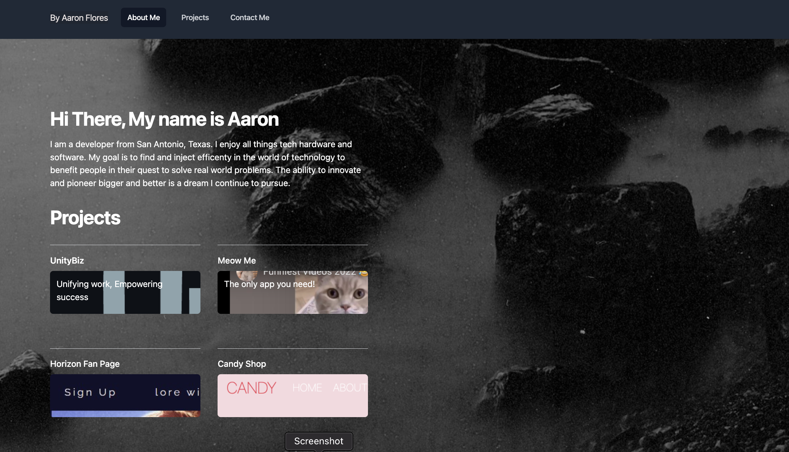

# My Portfolio 2023

Hi there! 👋

This is first attempt to create a personal profile and portfolio deployed site made in June 2023.

Originally made as a project for school.  It was made from scratch using HTML and Tailwind. 💻

I the future I plan on updated the profile site with inplemented functionallity using other programing languages.

For this project my criteria was as follows:

## Link to my site
  

https://aaronf87.github.io/profile/

I have plans to update the site as I continue to learn new technologies.💻

# Questions

If you have any questions feel free to contact via email at aaron_flores08@yahoo.com